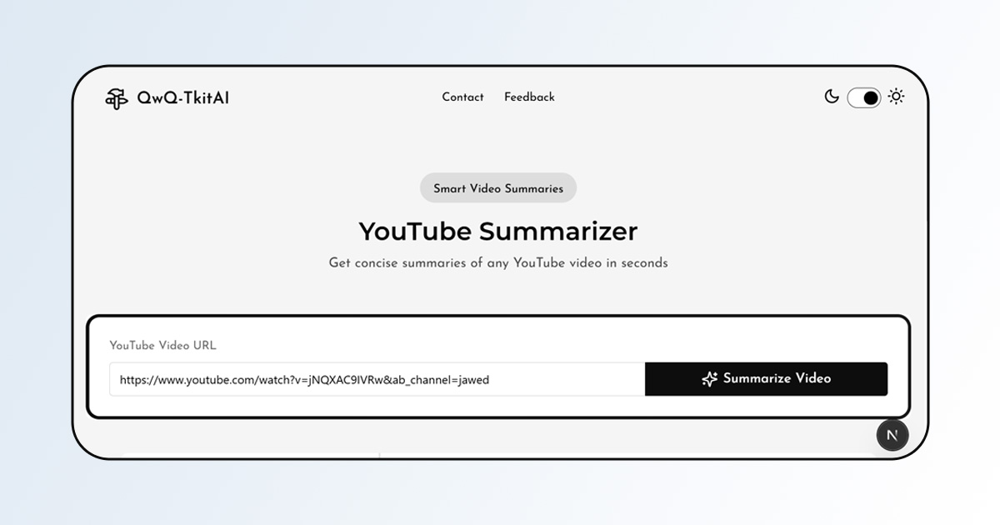

# YouTube Summarizer

An AI-powered free YouTube summarizer that extracts key points from any public YouTube video in any language. Supports multilingual summarization and translation in Arabic, English, and French.

 

## Features

- **Any YouTube Video**: Works with any public YouTube video.
- **AI-Powered Summarization**: Extracts key points automatically.
- **Multilingual Support**: Summarizes videos in Arabic, English, or French.

## Live Demo

Check out the live demo here: [Live Demo](https://qwqtoolkit-68fg376ix-redouaneabdlhs-projects.vercel.app/)

## Installation

Clone the repository and install dependencies:

```sh
npm install
```

## Usage

Run the development server:

```sh
npm run dev
```

Build the project:

```sh
npm run build
```

## Environment Variables

Create a `.env` file in the root directory and configure it as follows:

```ini
YOUTUBE_API_KEY= 
GEMINI_API_KEY=

API_ACCESS_KEY=redwan35
```
ps: you can get your free gemini key [here](https://aistudio.google.com/)

## Tech Stack

- **Framework**: Next.js
- **Styling**: Tailwind CSS, DaisyUI
- **Backend**: Node.js, django for deployment using youtube-transcript-api package 
- **AI Models**: Uses AI for text summarization and translation
- **APIs**: `youtube-transcript` for transcript extraction

## Dependencies

```json
{
  "next": "15.2.3",
  "react": "^19.0.0",
  "axios": "^1.8.4",
  "tailwindcss": "^4.0.15",
  "daisyui": "^5.0.9",
  "youtube-transcript": "^1.2.1"
}
```

## License

This project is licensed under the MIT License.

## Contributing

Pull requests are welcome. For major changes, please open an issue first to discuss what you would like to change.

## Contact

For inquiries, please reach out via GitHub Issues.


